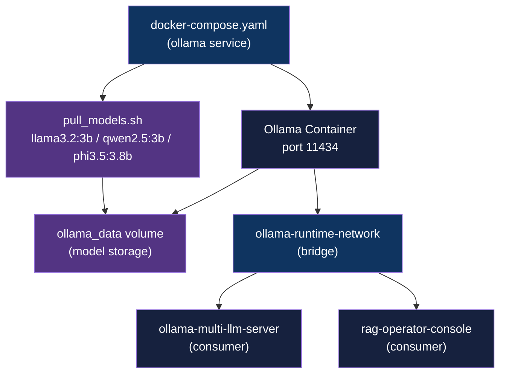
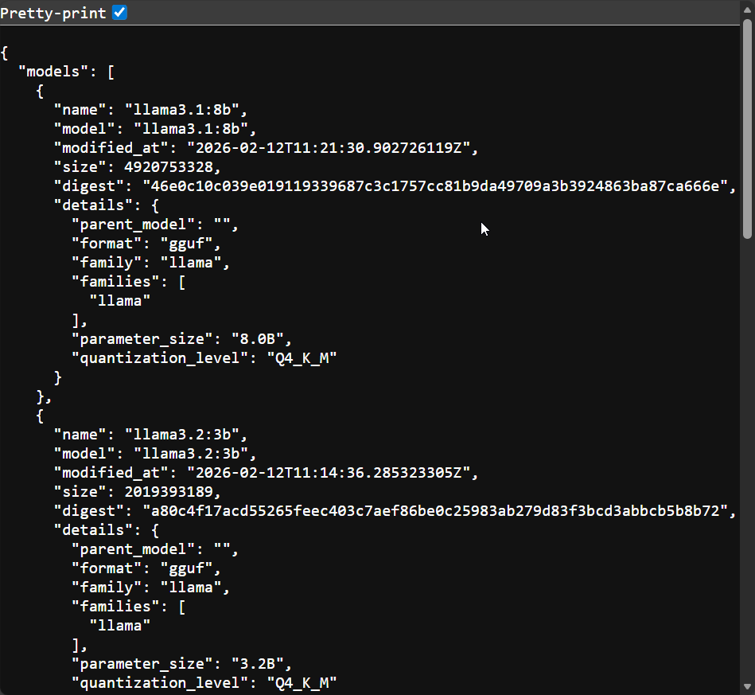
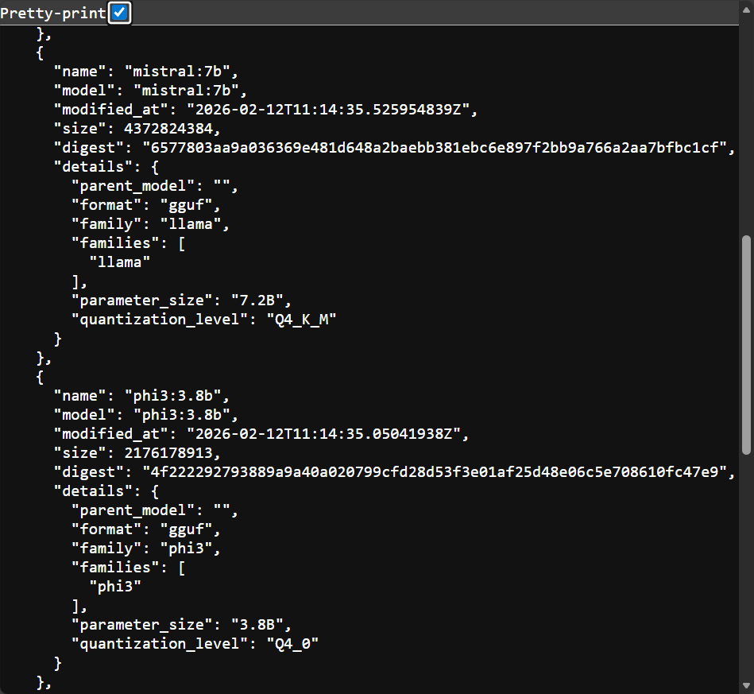
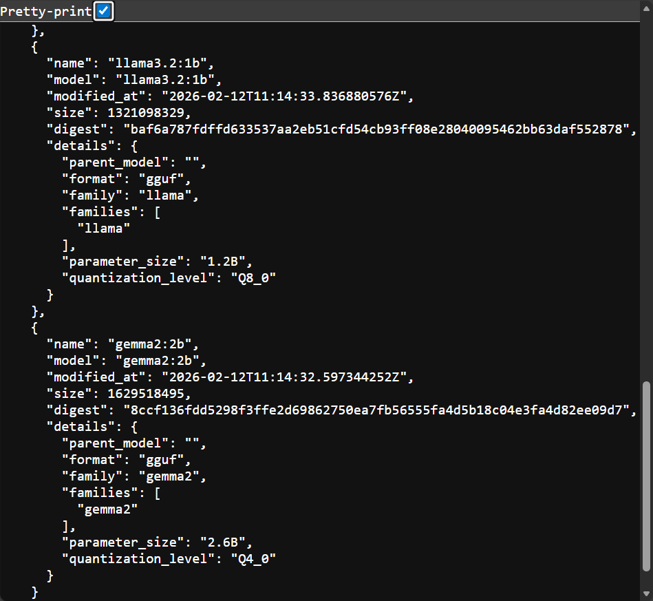

<div align="center">

# Ollama Runtime

[](https://docs.docker.com/compose/)
[](LICENSE)

**GPU-accelerated Ollama container with a shared Docker bridge network for multi-app local LLM serving**

[Getting Started](#getting-started) | [Usage](#usage) | [Architecture](#architecture)

</div>

---

## Table of Contents

- [Features](#features)
- [Tech Stack](#tech-stack)
- [Architecture](#architecture)
- [Demo](#demo)
- [Getting Started](#getting-started)
  - [Prerequisites](#prerequisites)
  - [Installation](#installation)
- [Usage](#usage)
- [Project Structure](#project-structure)
- [Testing](#testing)
- [Deployment](#deployment)
- [Architectural Decisions](#architectural-decisions)
- [Related Projects](#related-projects)
- [License](#license)
- [Author](#author)

## Features

- **GPU acceleration** - NVIDIA GPU passthrough via `nvidia-container-toolkit` for faster inference; CPU fallback if no GPU is present
- **Shared Docker network** - exposes `ollama-runtime-network` (bridge) so any local service can reach Ollama at `http://ollama:11434`
- **Centralized model storage** - models are pulled once into a named Docker volume (`ollama_data`) and reused across all connected apps
- **Lifecycle independence** - the runtime starts and stops independently of any consumer service
- **Multi-model support** - ships with pull scripts for `llama3.2:3b`, `qwen2.5:3b`, and `phi3.5:3.8b` (all Q4_K_M quantized, 1.9-2.2 GB each)

## Tech Stack

| Component | Technology |
|-----------|------------|
| LLM runtime | Ollama (latest) |
| Containerization | Docker + Docker Compose v2 |
| Networking | Docker bridge (`ollama-runtime-network`) |
| Hardware acceleration | NVIDIA GPU via `nvidia-container-toolkit` |
| Test suite | pytest + httpx + pyyaml |

## Architecture



The Ollama container is the only service defined here. Consumer apps declare `ollama-runtime-network` as an external network in their own `docker-compose.yaml` and connect to `http://ollama:11434` without any coupling to this repo's lifecycle.

## Demo

| Model serving - terminal view 1 | Model serving - terminal view 2 | Model serving - terminal view 3 |
|---|---|---|
|  |  |  |

## Getting Started

### Prerequisites

- Docker with Compose v2 (`docker compose version`)
- NVIDIA GPU + `nvidia-container-toolkit` for GPU acceleration (optional; CPU fallback works)

### Installation

1. Clone the repository:
   ```bash
   git clone https://github.com/adityonugrohoid/ollama-runtime.git
   cd ollama-runtime
   ```

2. Start the Ollama container:
   ```bash
   ./scripts/start.sh
   ```

3. Pull models into the runtime:
   ```bash
   ./scripts/pull_models.sh
   ```

4. Verify the runtime is serving:
   ```bash
   curl http://localhost:11434/api/tags
   ```

## Usage

| Command | Description |
|---------|-------------|
| `./scripts/start.sh` | Start the Ollama container |
| `./scripts/stop.sh` | Stop the Ollama container |
| `./scripts/restart.sh` | Restart the Ollama container |
| `./scripts/pull_models.sh` | Pull all configured models into the volume |

### Ports

| Service | Port | URL |
|---------|------|-----|
| Ollama API | 11434 | `http://localhost:11434` |

### Network integration

Consumer apps attach to the shared network by declaring it as external in their `docker-compose.yaml`:

```yaml
networks:
  ollama-network:
    external: true
    name: ollama-runtime-network
```

Once attached, the Ollama API is available at `http://ollama:11434` inside any container on that network.

### Available models

| Family | Model | Size | Notes |
|--------|-------|------|-------|
| Meta | `llama3.2:3b` | 2.0 GB | Default - general-purpose |
| Alibaba | `qwen2.5:3b` | 1.9 GB | Strong multilingual support |
| Microsoft | `phi3.5:3.8b` | 2.2 GB | Reasoning, code, structured output |

All three are Q4_K_M quantized. `llama3.2:3b` is the default across consumer apps.

## Project Structure

```
ollama-runtime/
├── scripts/
│   ├── start.sh           Start Ollama container
│   ├── stop.sh            Stop Ollama container
│   ├── restart.sh         Restart Ollama container
│   ├── pull_models.sh     Pull configured models into the volume
│   └── setup_venv.sh      Set up Python venv for tests
├── tests/
│   ├── conftest.py
│   ├── test_docker_config.py   Validates docker-compose.yaml structure
│   ├── test_ollama_api.py      Integration test for Ollama API reachability
│   └── test_scripts.py
├── docs/
│   ├── images/            Screenshots of model serving
│   ├── NETWORK.md         Network topology reference
│   └── SETUP.md           Detailed setup guide
├── docker-compose.yaml    Ollama service + shared network definition
├── requirements.txt       Test dependencies
└── README.md
```

## Testing

Unit tests validate the Docker Compose config structure. Integration tests check live API reachability and require the container to be running.

```bash
# Install test dependencies
pip install -r requirements.txt

# Run unit tests (no container needed)
pytest tests/ -v -m "not integration"

# Run integration tests (container must be running)
./scripts/start.sh
pytest tests/ -v -m integration
```

## Deployment

This repo is intended for local multi-app LLM serving. Start it once and leave it running while other services connect.

### Docker Compose

```bash
# Start in detached mode
docker compose up -d

# Check logs
docker compose logs -f ollama

# Stop
docker compose down
```

### GPU setup (NVIDIA)

Install `nvidia-container-toolkit` before starting:

```bash
# Ubuntu/Debian
sudo apt-get install -y nvidia-container-toolkit
sudo nvidia-ctk runtime configure --runtime=docker
sudo systemctl restart docker
```

The `docker-compose.yaml` already includes the GPU reservation block; no changes needed after toolkit installation.

## Architectural Decisions

### 1. Lifecycle-independent shared network

**Decision:** The Ollama container and its Docker network (`ollama-runtime-network`) are defined in a standalone repo rather than embedded in each consumer's Compose file.

**Reasoning:** Embedding Ollama in every consumer app would require each service to manage model storage and GPU reservation independently, wasting disk and memory. A standalone runtime with an external network lets consumers start and stop without affecting model state or each other. The tradeoff is that this repo must be running before any consumer starts.

### 2. Named volume for model storage

**Decision:** Model weights are stored in a Docker named volume (`ollama_data`) rather than a bind-mount path.

**Reasoning:** A named volume survives `docker compose down` and is portable across host paths, avoiding the need to re-pull multi-gigabyte models on each restart. Bind-mounts would tie the setup to a specific directory structure on the host.

## Related Projects

| Project | Description |
|---------|-------------|
| [ollama-multi-llm-server](https://github.com/adityonugrohoid/ollama-multi-llm-server) | Multi-model inference API and Streamlit playground over local Ollama LLMs |
| [rag-operator-console](https://github.com/adityonugrohoid/rag-operator-console) | RAG pipeline with operator console for prompt assembly visibility and debugging |

## License

This project is licensed under the [MIT License](LICENSE).

## Author

**Adityo Nugroho** ([@adityonugrohoid](https://github.com/adityonugrohoid))
