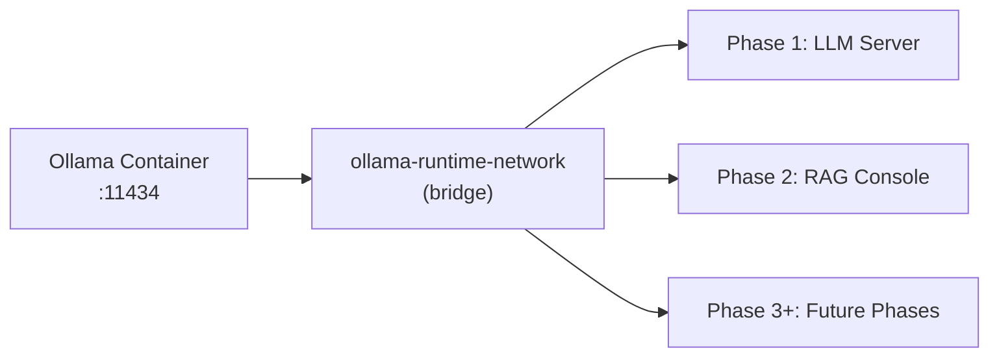

# GenAI Portfolio Suite – Phase 0: Ollama Runtime

Shared Ollama LLM runtime for the **GenAI Portfolio Suite**.

This repository provides a GPU-accelerated Ollama container and shared Docker network that all portfolio phases connect to.

**Part of the [GenAI Portfolio Suite](https://github.com/adityonugrohoid).**  
> **Phase:** 0 – LLM Runtime & Infrastructure

---

## Table of Contents

- [Overview](#overview)
- [Quick Start](#quick-start)
- [Architecture](#architecture)
- [Features](#features)
- [Available Models](#available-models)
- [Requirements](#requirements)
- [Usage](#usage)
- [Project Structure](#project-structure)
- [Tech Stack](#tech-stack)
- [Author](#author)
- [License](#license)

---

## Overview

`ollama-runtime` is the **shared LLM runtime** for the suite.  
It runs a single Ollama container that:

- Exposes the standard Ollama API on port `11434`
- Hosts all configured models (pulled once, reused by all phases)
- Provides a shared Docker network so other services can reach Ollama at `http://ollama:11434`

---

## Quick Start

```bash
./scripts/start.sh
curl http://localhost:11434/api/tags
```

To stop:

```bash
./scripts/stop.sh
```

---

## Architecture



Ollama runs as an independent service that other phases connect to via the shared Docker network `ollama-runtime-network`.

---

## Features

<table>
<tr>
<td align="center">

<br/><strong>Model Serving 1</strong>
</td>
<td align="center">

<br/><strong>Model Serving 2</strong>
</td>
<td align="center">

<br/><strong>Model Serving 3</strong>
</td>
</tr>
</table>

- **Shared LLM Runtime** – single Ollama instance used by all portfolio phases
- **GPU Acceleration** – optional NVIDIA GPU support for faster inference
- **Model Management** – centralized model storage, pulled once and reused
- **Network Isolation** – dedicated Docker network for secure inter-container communication
- **Lifecycle Independence** – can be started/stopped independently of other phases

---

## Available Models

> **Default model across Phase 0-1-2:** `llama3.2:3b`

All models are 3B-class Q4_K_M quantized for consistent performance.

| Family    | Model         | Size   | Notes                        |
|-----------|--------------|--------|------------------------------|
| Meta      | llama3.2:3b  | 2.0 GB | **Default** -- general-purpose |
| Alibaba   | qwen2.5:3b   | 1.9 GB | Strong multilingual support  |
| Microsoft | phi3.5:3.8b  | 2.2 GB | Reasoning, code, structured  |

These are pulled via `./scripts/pull_models.sh` and then reused by all phases.

---

## Requirements

- Docker with Compose v2
- NVIDIA GPU + `nvidia-container-toolkit` (for GPU acceleration, optional but recommended)

---

## Usage

| Command | Description |
|---------|-------------|
| `./scripts/start.sh` | Start Ollama container |
| `./scripts/stop.sh` | Stop Ollama container |
| `./scripts/restart.sh` | Restart Ollama container |
| `./scripts/pull_models.sh` | Download all configured models |

### Ports

| Service | Port | URL |
|---------|------|-----|
| Ollama API | 11434 | http://localhost:11434 |

Port scheme across the suite:
- **Phase 0:** 11434 (standard Ollama port)
- **Phase 1:** 1xxx range (e.g. 1080, 1501)
- **Phase 2:** 2xxx range (e.g. 2080, 2501)

### Network Integration

This repository creates the shared Docker network:
- Network name: `ollama-runtime-network`
- Driver: `bridge`
- Ollama is reachable for other containers at: `http://ollama:11434`

This repository provides the shared Ollama service for:
- **Phase 1:** [ollama-multi-llm-server](https://github.com/adityonugrohoid/ollama-multi-llm-server) – Multi-model inference API + playground
- **Phase 2:** [rag-operator-console](https://github.com/adityonugrohoid/rag-operator-console) – RAG pipeline + operator debugging UI
- **Phase 3+:** Future phases in the suite

Each phase's `docker-compose.yaml` declares `ollama-runtime-network` as an external network:

```yaml
networks:
  ollama-network:
    external: true
    name: ollama-runtime-network
```

This keeps Ollama's lifecycle **independent** while allowing all phases to share the same LLM runtime.

---

## Project Structure

```
ollama-runtime/
├── scripts/
│   ├── start.sh           Start Ollama container
│   ├── stop.sh            Stop Ollama container
│   ├── restart.sh          Restart Ollama container
│   └── pull_models.sh     Download all configured models
├── docker-compose.yaml     Ollama service + network definition
├── LICENSE
└── README.md
```

---

## Tech Stack

- **Runtime:** Ollama
- **Containerization:** Docker + Docker Compose
- **Networking:** `ollama-runtime-network` (bridge)
- **Hardware Acceleration:** NVIDIA GPU (optional)

---

## Author

**Adityo Nugroho** – [github.com/adityonugrohoid](https://github.com/adityonugrohoid)

---

## License

MIT License – see [LICENSE](LICENSE).
